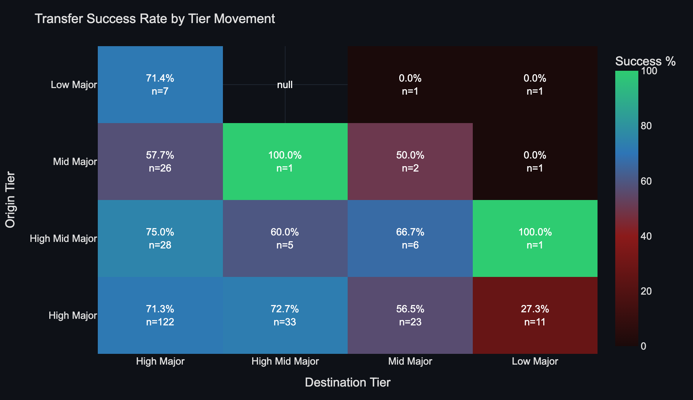
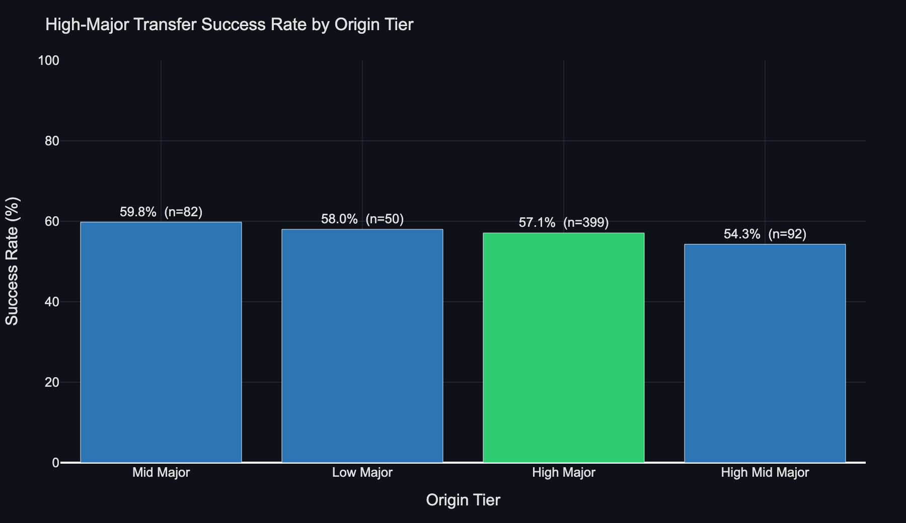
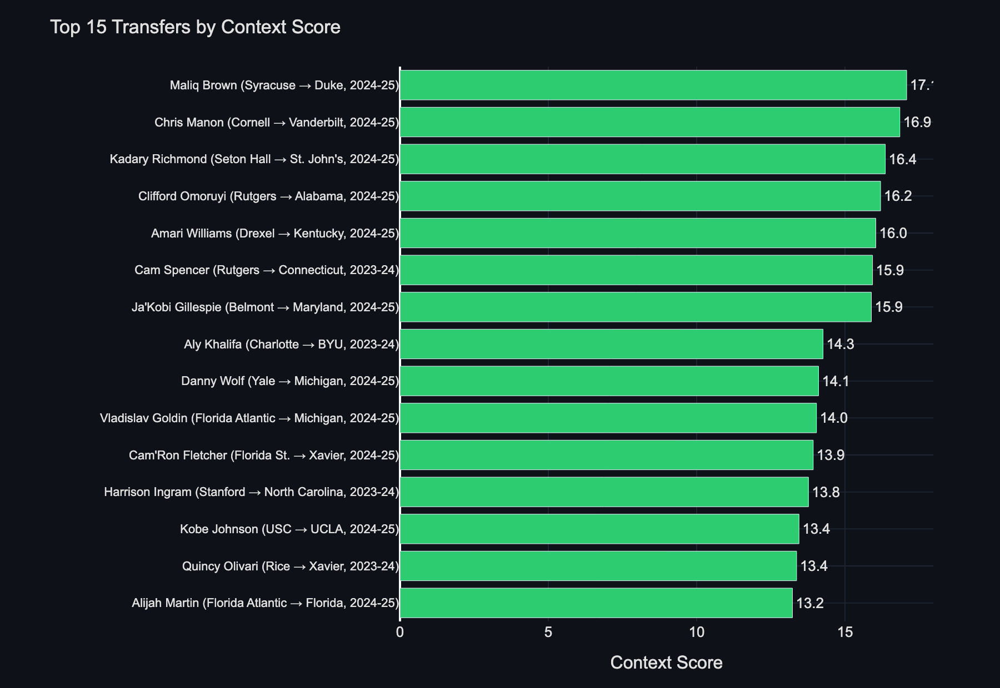
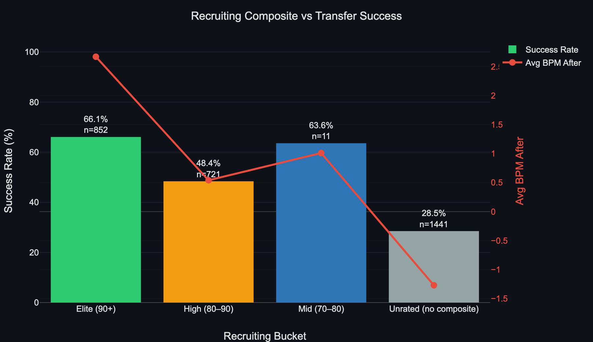
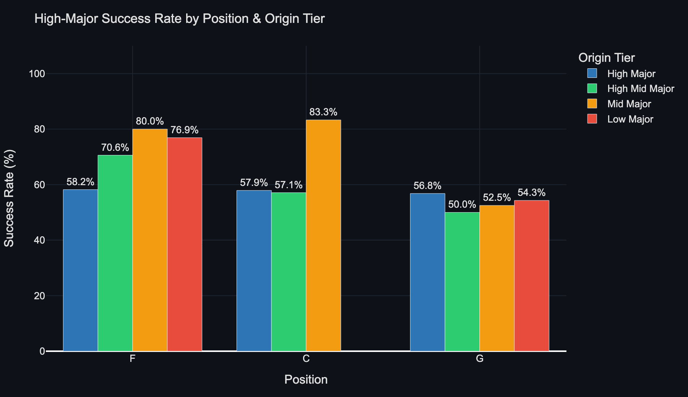
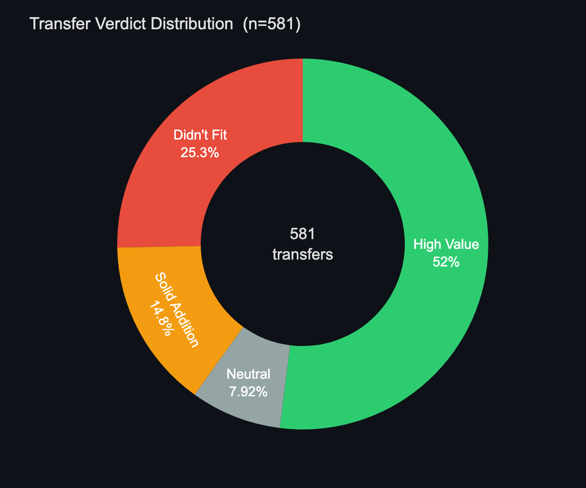

# NCAA Transfer Portal Analysis

Analytics platform for men's college basketball transfers (2020–21 through 2025–26). Scores 3,025 of 8,208 portal entries using Box Plus/Minus, classifies programs by conference tier, and surfaces data-driven recruitment profiles across a 9-tab Streamlit dashboard.

3,025 scored transfers · 8,208 total portal entries · 350 of 364 D1 schools · 2020–21 through 2025–26

## Data Sources

| Source | Use |
|---|---|
| [College Basketball Reference](https://www.sports-reference.com/cbb/) | BPM, box scores, player pages |
| [Barttorvik](https://barttorvik.com) | Portal entries, all seasons |
| [On3](https://on3.com) | Recruiting composites |

All scrapers use 2–3s delays between requests and handle 429 rate-limit responses with exponential backoff.

---

## Charts

> Regenerate any time with `python3 generate_charts.py` — pulls live from the database.

### Transfer Success Rate by Tier Movement

*Every cell shows the success rate and sample size for that origin → destination tier pair. High Major → High Major is the most active route (n=311, 69.1%). High Major → Mid Major is the weakest at 42.1% — the largest downgrade in success rate for any high-volume route.*

---

### High-Major Success Rate by Origin Tier

*At high-major destinations, low-major (74.4%) and mid-major (69.7%) step-ups slightly outperform same-tier high-major laterals (69.1%). High-mid major transfers (67.1%) are the weakest, suggesting over-competition relative to expectation at high-major programs.*

---

### Top 15 Transfers by Context Score

*Context score = `bpm_after × tier_weight × role_weight`. It rewards performing at a high level in a harder environment with a smaller role. Walker Kessler (North Carolina → Auburn, ctx=20.9), Oscar Tshiebwe (West Virginia → Kentucky, 18.0), and Tari Eason (Cincinnati → LSU, 16.9) lead the dataset — all moved to high-major programs and exceeded expectations.*

---

### Recruiting Composite vs Transfer Success

*Recruiting pedigree is the single strongest predictor of transfer success. Elite recruits (90+ composite) succeed at 83.5% and average +4 BPM after transferring. Low-recruit players succeed at 42.6% and average negative BPM — pedigree doesn't expire.*

---

### Success Rate by Position & Origin Tier (High-Major Destinations)

*The standout: high-mid major Centers transferring to high-major programs succeed at 92.9% — the highest of any position/route combination. Low-major Forwards are also elite at 87.5%. Mid-major Guards are the weakest route at 69.2%.*

---

### Verdict Distribution

*Across all 1,038 scored transfers, the model uses absolute BPM after transfer as the verdict threshold — the bar is the same regardless of where a player came from. Coverage spans 2021-22 through 2024-25.*

---

## Conference Tiers
| Tier | Conferences |
|------|-------------|
| `high_major` | ACC, Big Ten, Big 12, SEC, Big East, Pac-12 |
| `high_mid_major` | AAC, Mountain West, WCC, Atlantic 10 |
| `mid_major` | MVC, MAC, CUSA, Sun Belt, CAA, Horizon, Big West, SoCon |
| `low_major` | Big South, NEC, OVC, SWAC, MEAC, Patriot, America East, WAC, Ivy, ASUN |
| `sub_d1` | JUCO, NCAA D2, NCAA D3, NAIA — any non-D1 domestic origin |
| `international` | Players from foreign professional or semi-pro leagues (Europe, FIBA circuits) |

---

## Scoring Model

### Context Score (primary metric)
```
context_score = bpm_after × tier_weight × role_weight
```

**Tier weight** — the higher the destination, the more credit for the same BPM:
| Destination | Weight |
|-------------|--------|
| high_major | 1.35 |
| high_mid_major | 1.15 |
| mid_major | 0.90 |
| low_major | 0.75 |

**Role weight** — producing BPM in a smaller role is harder:
| Usage change | Weight |
|-------------|--------|
| Lost 5+ pts USG% | 1.20 |
| Lost 2–5 pts USG% | 1.10 |
| Gained 2–5 pts USG% | 0.95 |
| Gained 5+ pts USG% | 0.85 |
| Minimal change | 1.00 |

**Why this matters:** A 6'10" low-major big going to a role at a Power 5 program may drop raw BPM but hold value — the context score surfaces that. A high-usage low-major guard who lands a bigger role at mid-major and posts production gets credit for both the tier competition and the usage context.

### Verdicts (based on absolute bpm_after)
Context score is a *ranking* metric — it rewards harder environments. Verdicts use a fixed BPM bar so the standard is consistent across tiers.

| BPM After | Verdict |
|-----------|---------|
| > 2.0 | High Value |
| > 0.5 | Solid Addition |
| > −0.5 | Neutral |
| ≤ −0.5 | Didn't Fit |

### Supporting stats
- `bpm_change` — raw BPM delta (after minus before), simple and transparent
- `usg_change` — usage rate change, shows role expansion/contraction
- `transfer_premium` — BPM vs peer baseline (players who made same tier jump with similar recruiting composite)

---

## Six Reports

### 1 — Individual Transfer Scores
Full player-level breakdown: context score, BPM change, role change, verdict.
View: `individual_transfer_scores`

### 2 — Team Transfer Portfolio
Per-team transfer class: origin tier mix, avg context score, avg BPM, wins/efficiency.
View: `team_transfer_report`

### 3 — League Recruitment Profiles
**Tier/league level** — not individual programs. What profile (position, BPM floor, usage, height, weight) succeeds at each tier when recruited from each origin tier.
View: `recruitment_profiles`

### 4 — League Transfer Trends
Season-by-season breakdown by tier pair and position: success rates, avg context score, avg physical profile of transfers.
View: `league_transfer_trends`

### 5 — Player Fit Finder (dashboard only)
Player inputs their profile (position, height, weight, birth year, BPM, USG%, current tier). System finds comparable transfers and shows which destination tiers they thrived in.
Tab: Player Fit Finder in `app.py`

### 6 — Coach Search (dashboard only)
Coaches input their program tier, conference, season, and role need. System returns Strong Matches and Matches from the historical transfer pool with CBB Reference profile links.
Tab: Coach Search in `app.py`

---

## Player Attributes
| Field | Source | Notes |
|-------|--------|-------|
| Position | Portal / On3 | G, G/F, F, F/C, C |
| Height | On3 | Stored as inches |
| Weight | On3 | Stored as lbs |
| Birth year | On3 | Used for age context |
| Recruiting composite | Portal / On3 | 0–100 scale |

Height and weight are included in all views for correlation analysis. Once re-scraped On3 data is loaded, they populate in `recruitment_profiles` and `league_transfer_trends` to show the physical profile of successful transfers by tier and position.

---

## Data Sources
| Data | Source | Method |
|------|--------|--------|
| Transfer records 2016–2022 | Kaggle (`collegeBasketBallTransferMen.csv`) | Downloaded via Kaggle CLI |
| Transfer records 2022–2025 (top 50 rated/year) | On3 portal main page | `etl/scrape_on3.py` |
| Transfer records 2022–2025 (all entrants) | On3 school team pages | `etl/scrape_on3_team_pages.py` — 2,940 records |
| International transfers | Manual CSV + On3 topList | `data/international_transfers.csv` |
| Team stats (wins, ADJOE) | College Basketball Reference CSVs | `data/raw/cbb21.csv` – `cbb26.csv` |
| Real player BPM / TS% / USG% | CBB Reference school pages | `etl/scrape_cbb_reference.py` — 20,267 player-season rows, 329 schools |
| Height / weight / birth year | On3 (re-scrape) | `etl/scrape_on3.py` (updated) |
| Conference tiers | Manual seed CSV | `data/conferences_seed.csv` |

---

## Project Structure
```
TransferPortal/
├── sql/
│   ├── 01_schema.sql              ← all 6 tables + enum types
│   ├── 02_seed_conferences.sql    ← loads 31 conferences with tier
│   └── 03_views.sql               ← 5 analytical views (incl. materialized)
├── etl/
│   ├── seed_synthetic.py          ← synthetic data for model validation
│   ├── scrape_on3.py              ← scrapes On3 topList (top 50 rated/year) for composites
│   ├── scrape_on3_team_pages.py   ← scrapes On3 school pages for ALL portal entrants (2,940 records)
│   ├── scrape_cbb_reference.py    ← scrapes real BPM/TS%/USG% per school-season (329 schools)
│   └── load_real_data.py          ← master ETL: team stats → transfers → real stat overrides
├── data/
│   ├── conferences_seed.csv       ← static tier lookup (31 conferences)
│   ├── international_transfers.csv ← manually curated international-to-NCAA transfers
│   └── raw/
│       ├── cbb21.csv – cbb26.csv          ← team stats per season
│       ├── collegeBasketBallTransferMen.csv ← Kaggle portal data
│       ├── on3_transfers_combined.csv      ← On3 topList scraper output
│       ├── on3_transfers_full.csv          ← On3 team-page scraper output (2,940 records)
│       └── cbb_player_stats.csv           ← CBB Reference real player stats (20,267 rows)
├── app.py                         ← 6-tab Streamlit dashboard
├── db.py                          ← shared DB connection config (reads .env)
├── requirements.txt
└── setup.sh                       ← one-shot environment setup
```

---

## Database Schema
| Table | Description |
|-------|-------------|
| `conferences` | Tier classification for all 31 conferences |
| `teams` | School + conference + season (handles realignment year-by-year) |
| `players` | Name, position, height (in), weight (lbs), birth year, class year, recruiting composite |
| `transfers` | From/to team, season, transfer type |
| `player_seasons` | Per-season stats: PPG, BPM, USG%, TS%, PORPAG, etc. |
| `team_seasons` | Team wins/losses + adjusted efficiency |

---

## SQL Views
| View | Type | Description |
|------|------|-------------|
| `tier_pair_expectations` | Materialized | Avg BPM baseline by tier-pair + recruiting tier |
| `individual_transfer_scores` | View | Full player scoring: context_score, bpm_change, usg_change, verdict |
| `team_transfer_report` | View | Per-team transfer class outcomes |
| `recruitment_profiles` | View | League-level: profile of successful transfers by dest/origin tier + position |
| `league_transfer_trends` | View | Season-by-season success rates, physical profile, by tier pair + position |

---

## Run Order
```bash
# 1. Copy env template and fill in your Postgres credentials
cp .env.example .env

# 2. Install dependencies and create the database
bash setup.sh

# 3. Scrape On3 top-rated portal entrants (composites, height, weight, birth year)
python3 etl/scrape_on3.py

# 4. Scrape ALL portal entrants from On3 school pages (~90 min, resumable)
python3 etl/scrape_on3_team_pages.py

# 5. Scrape real player stats from CBB Reference (~60 min, resumable)
python3 etl/scrape_cbb_reference.py

# 6. Load all data into PostgreSQL
python3 etl/load_real_data.py

# 7. Launch dashboard
streamlit run app.py
```

---

## Dashboard — app.py
Six-tab Streamlit app running at `http://localhost:8501`

| Tab | Content |
|-----|---------|
| Transfer Overview | Season KPIs, tier-to-tier flow heatmap, volume by season |
| Individual Scores | Context score bar chart, verdict breakdown, full table with BPM Δ / USG Δ |
| Team Portfolio | Transfer class composition, origin tier mix, premium vs wins |
| Recruit Profiles | League-level stat floors + physical profile by tier and position |
| Player Fit Finder | Input your profile → see comparable transfers + best destination tiers |
| Coach Search | Filter by tier, conference, position, BPM/USG floor → ranked Strong Matches + Matches with CBB Reference links |

Sidebar filters: season, position, destination tier.

---

## Current Status
- [x] PostgreSQL schema with height, weight, birth year, recruiting composite
- [x] 32 conferences seeded across 5 tiers (including `sub_d1` and `international`)
- [x] CBB team stats loaded (cbb21–cbb26, 6 seasons)
- [x] Kaggle transfer portal data loaded (2021–2025)
- [x] On3 topList scraped for composites (top 50 rated/year, 2022–2025)
- [x] **Full portal coverage**: On3 school team pages scraped — 2,940 unique player-year records
- [x] **International player support**: 19 international-to-NCAA transfers tracked, scored on D1 BPM at destination
- [x] Real BPM / TS% / USG% from CBB Reference (20,267 player-season rows, 329 schools, zero estimation)
- [x] Context score model live — verdicts use absolute bpm_after, context_score used for ranking only
- [x] 5 SQL views including materialized peer baseline (`tier_pair_expectations`)
- [x] Data cleaning: small-sample BPM nulled (< 12 games), duplicate transfers resolved, view Cartesian products fixed
- [x] **1,038 fully scored transfers** across 4 seasons (2021-22 through 2024-25) — 100% real CBB Reference data
- [x] JUCO/D2/D3/NAIA origin support via `sub_d1` tier — scores based on D1 destination BPM
- [x] 6-tab Streamlit dashboard: Overview, Individual Scores, Team Portfolio, Recruit Profiles, Player Fit Finder, Coach Search
- [x] Coach Search: Strong Match / Match tiers, USG%-based role projection, CBB Reference links
